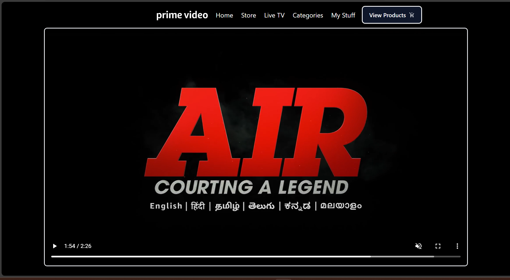
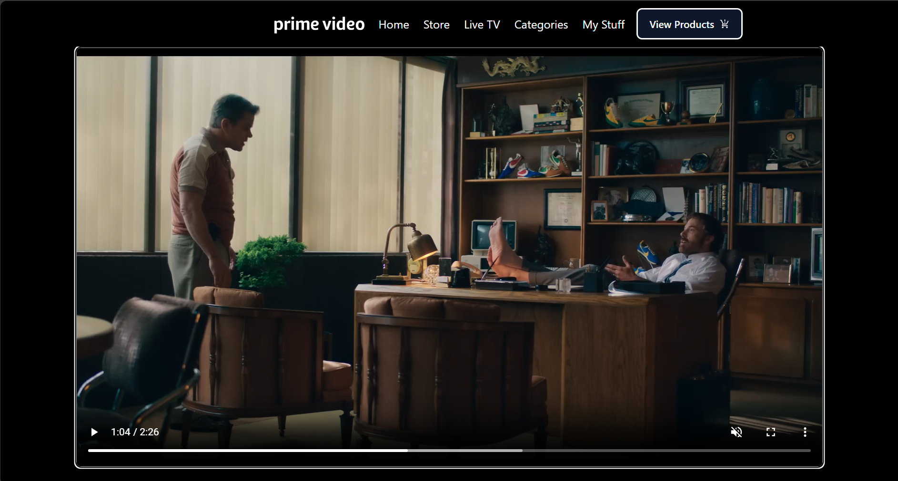

# Visual AI & E-Commerce Integration with Amazon Prime

## Team Name: HeavyComders
### Team Members:
- Eashan Bhatia
- Aman Bhardwaj

### Idea Submission Presentation: [HeavyComders Presentation](https://drive.google.com/file/d/1CSnzxC1jnVE1mqxHUcMpwTZ83e2NjVmb/view?usp=sharing)

## Project Overview:
Our project enhances the Amazon Prime viewing experience by integrating a Visual AI e-commerce feature. This feature extends the existing X-Ray function in Amazon Prime, allowing users to click on intriguing products seen in a movie or TV show and instantly view and purchase these items on Amazon.

## Key Objectives:
1. **Seamless Integration**:
   - **Objective**: To integrate the product identification and purchasing feature into the existing Amazon Prime Video interface without disrupting the viewing experience.
   - **Details**:
     - Ensure that the new feature blends naturally with the current X-Ray function.
     - Maintain the aesthetics and user experience of Amazon Prime Video.
     - Offer an intuitive and straightforward process for users to identify and purchase products.

2. **Enhanced Shopping Experience**:
   - **Objective**: To provide users with a smooth and engaging shopping experience directly from the video content.
   - **Details**:
     - Allow users to access product information and purchase options without leaving the video content.
     - Include detailed product descriptions, reviews, and ratings to help users make informed purchase decisions.
     - Offer a streamlined purchasing process with minimal clicks from product identification to checkout.

## Features:
1. **Extended X-Ray Feature**:
   - **View Products Button**:
     - User pauses a video and clicks on "View Products" button.
     - Clicking this button triggers the product identification process.
   - **Product Listing**:
     - The system detects products in the paused frame and displays a list of identified items.
     - Each product on the list includes an image, name, price, and a link to purchase the product from Amazon directly.

2. **Enhanced Shopping Experience**:
   - **Direct Links to Product Pages**:
     - Users can click on any product from the list to view its detailed page on Amazon.
   - **Seamless Transition**:
     - The transition from viewing to shopping is smooth, ensuring minimal disruption.
     - Users can easily navigate back to their video content after exploring or purchasing products.

## Technologies Used:
- **ReactJS**: For developing a user-friendly frontend interface.
- **Flask/ExpressJS**: For building the backend web application.
- **YOLO (You Only Look Once)**: For real-time object detection in video frames.
- **Cosine Similarity**: To match detected products with Amazon's product listings.
- **MongoDB**: For storing the products in the database.

## Demo:

### 1. Home Page :

 

### 2. Go to the Video :
- While watching a movie or show, see a cool outfit, furniture piece, or anything else that catches your eye?
- 

### 3. Viewing Identified Products:
- Click the "View Products" button. The system will analyze the frame and display a list of identified products in the scene.
- 
- 

### 4. Viewing Product Details on Amazon:
- Click on any product from the list to view its detailed page on Amazon, where you can see images, specifications, customer reviews, and ratings.
- 

### 5. Demo Videos:
- Watch a demonstration of pausing the video, clicking the "View Products" button, and displaying the identified products.
  - [Pausing Video and Viewing Products](./client/public/videos/first.gif)
- Watch a demonstration of clicking on a product from the list and being redirected to the Amazon product page for purchase.
  - [Clicking Product and Redirecting to Amazon](./client/public/videos/second.gif)