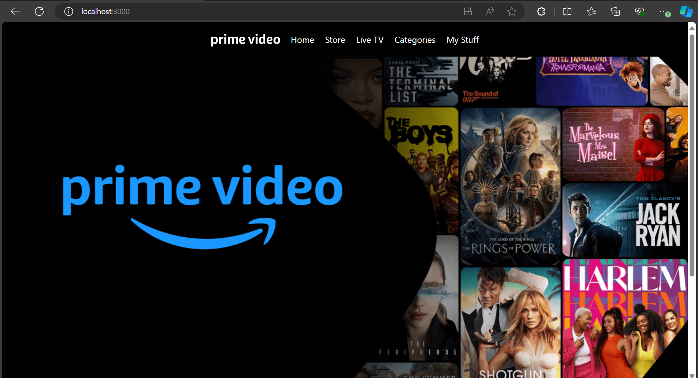
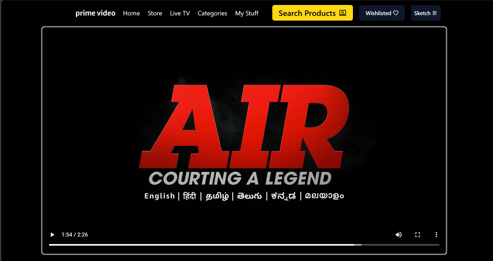
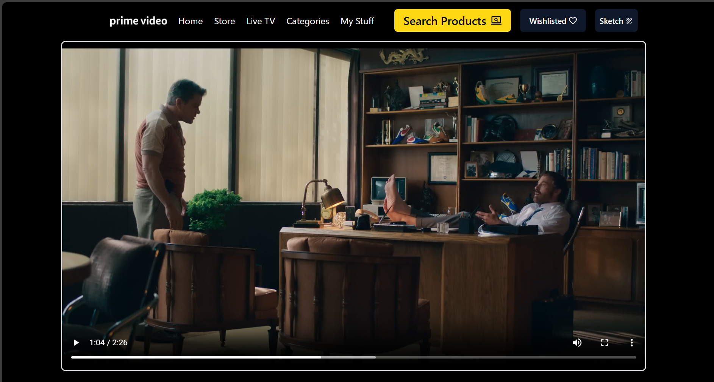
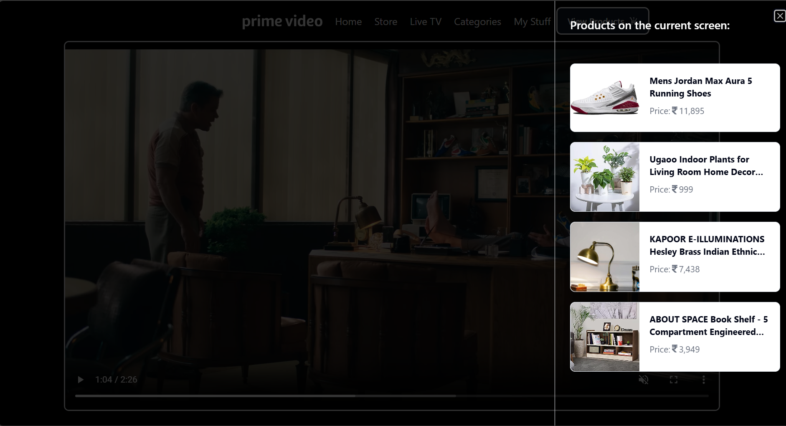
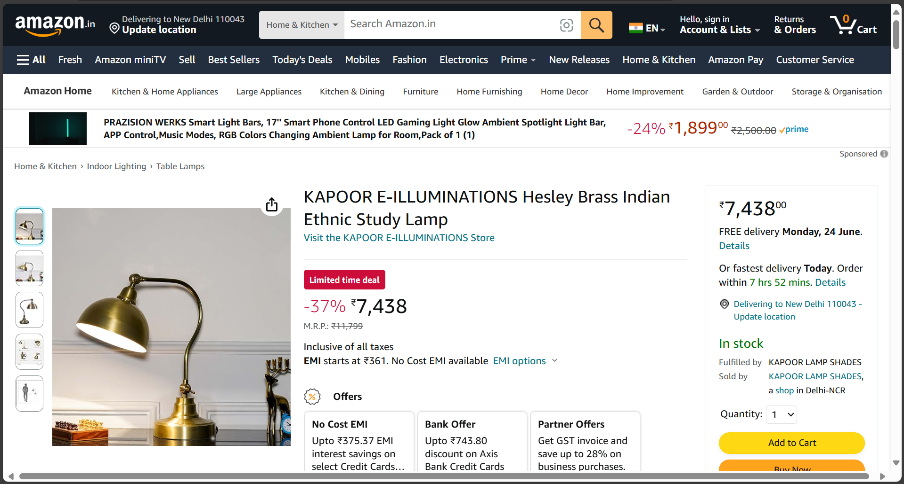

# Visual AI & E-Commerce Integration with Amazon Prime

## Team Name: HeavyComders
### Team Members:
- Eashan Bhatia
- Aman Bhardwaj

### Idea Submission Presentation: [HeavyComders Presentation](https://drive.google.com/file/d/1acrSknOgFZ5iC_utR0Z7-dz_3GBhIE5k/view?usp=sharing)

## Project Overview:
Our project enhances the Amazon Prime viewing experience by integrating a Visual AI e-commerce feature. This feature extends the existing X-Ray function in Amazon Prime, allowing users to click on intriguing products seen in a movie or TV show and instantly view and purchase these items on Amazon.

## Key Objectives:
1. **Seamless Integration**:
   - **Objective**: To integrate the product identification and purchasing feature into the existing Amazon Prime Video interface without disrupting the viewing experience.
   - **Details**:
     - Ensure that the new feature blends naturally with the current X-Ray function.
     - Maintain the aesthetics and user experience of Amazon Prime Video.
     - Offer an intuitive and straightforward process for users to identify and purchase products.

2. **Enhanced Shopping Experience**:
   - **Objective**: To provide users with a smooth and engaging shopping experience directly from the video content.
   - **Details**:
     - Allow users to access product information and purchase options without leaving the video content.
     - Include detailed product descriptions, reviews, and ratings to help users make informed purchase decisions.
     - Offer a streamlined purchasing process with minimal clicks from product identification to checkout.

## Features:
1. **Extended X-Ray Feature**:
   - **View Products Button**:
     - User pauses a video and clicks on "View Products" button.
     - Clicking this button triggers the product identification process.
   - **Product Listing**:
     - The system detects products in the paused frame and displays a list of identified items.
     - Each product on the list includes an image, name, price, and a link to purchase the product from Amazon directly.

2. **Enhanced Shopping Experience**:
   - **Direct Links to Product Pages**:
     - Users can click on any product from the list to view its detailed page on Amazon.
   - **Seamless Transition**:
     - The transition from viewing to shopping is smooth, ensuring minimal disruption.
     - Users can easily navigate back to their video content after exploring or purchasing products.

## Demo:

### 1. Home Page :
- Home page of our prototype
 

### 2. Go to the Video :
- While watching a movie or show, see a cool outfit, furniture piece, or anything else that catches your eye?
 

### 3. Viewing Identified Products:
- Click the "Search Products" button. The system will analyze the frame and display a list of identified products in the scene.
 
 

### 4. Viewing Product Details on Amazon:
- Click on any product from the list to view its detailed page on Amazon, where you can see images, specifications, customer reviews, and ratings.
 

### 5. Demo Videos:
- Watch a demonstration of pausing the video, clicking the "View Products" button, and displaying the identified products.
  
  
  
- Watch a demonstration of clicking on a product from the list and being redirected to the Amazon product page for purchase.
  
  

- The Sketch feature where the user can search for a single product of his/her choice.

  

## Technologies Used:
- **ReactJS**: For developing a user-friendly frontend interface.
- **Flask**: For building the backend web application.
- **YOLO (You Only Look Once)**: For real-time object detection in video frames.
- **Cosine Similarity**: To match detected products with Amazon's product listings.
- **MongoDB**: For storing the products in the database.

## Future Prospects:
- **Active Viewers, Passive Buyers**: Many Prime Video users primarily watch content without actively intending to shop. X-ray unlocks a new dimension by capturing their implicit purchase intent.
- **Impulse Purchases Made Easy**: X-ray eliminates the need to leave the streaming experience, this can be particularly effective for convenience-driven or impulse-prone consumers who might not have actively sought out the product but are enticed by its visual presence in a video.
- **Reaching New Consumer Segments**: It has the potential to attract demographics that might not traditionally be heavy Amazon shoppers. For example, younger audiences who are accustomed to in-app purchases and visually driven content can be drawn to the ease of X-ray. This broadens Amazon's reach beyond its established customer base.

